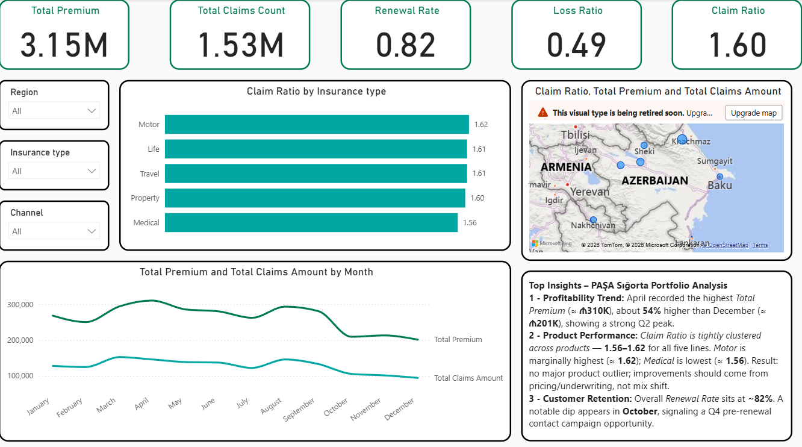
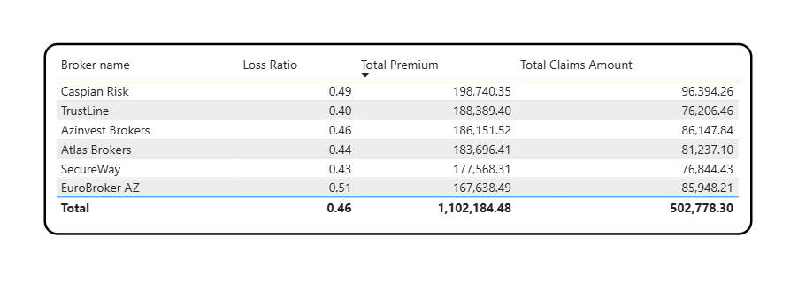
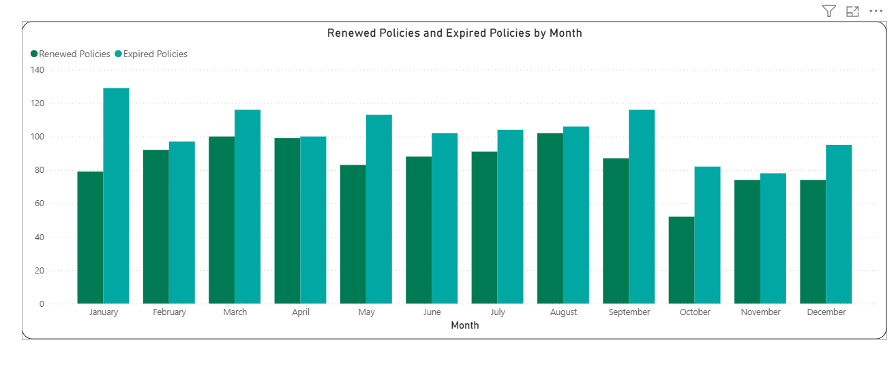
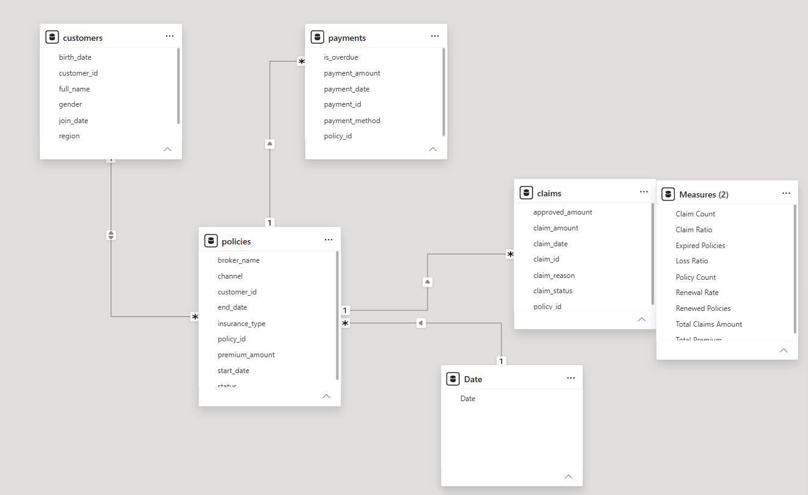

# Insurance Portfolio Analytics

**End-to-end insurance portfolio analysis using SQL, Python, and Power BI to evaluate profitability, claims risk, broker performance, payment behavior, and customer retention — and translate the findings into actionable management recommendations.**

---

## Project Overview

This project analyzes a synthetic insurance portfolio from both a technical and business perspective.

Rather than focusing only on dashboard development, the objective was to identify areas where portfolio performance could be improved and convert the analytical findings into concrete business actions.

The analysis covers the full workflow:

**SQL Analysis → Python Risk Exploration → Power BI Modeling & Reporting → Business Recommendations**

**Tech Stack:**  
SQL · Python · Pandas · Power BI · DAX · Data Modeling · Business Analysis

---

## Business Questions

The project was designed to answer questions such as:

- Which insurance products are generating the highest claims pressure?
- Which regions show higher claim frequency or severity?
- Are some sales channels or brokers contributing disproportionately to losses?
- Which customers or policies show elevated risk indicators?
- Is payment behavior associated with higher claims exposure?
- Are early claims or unusually large claims signaling potential risk?
- How effectively is the portfolio retaining customers?
- What actions should management prioritize based on the findings?

---

## Dashboard Preview

### Portfolio Performance



The main dashboard combines portfolio KPIs, insurance-type comparisons, regional analysis, monthly premium and claims trends, and management-oriented insights.

### Broker Performance



Broker-level analysis compares premium contribution, claims amount, and loss ratio to identify stronger and weaker distribution partners.

### Renewal Analysis



Monthly renewed and expired policy patterns provide visibility into customer retention and potential renewal pressure.

---

## Data Model

The Power BI model connects the core insurance entities:

- **Customers**
- **Policies**
- **Claims**
- **Payments**
- **Date dimension**
- **Measures**



The model enables analysis across customer, product, broker, channel, region, payment, claim, and time dimensions.

---

## Analytical Workflow

### 1. SQL — Portfolio Analysis

SQL was used to investigate portfolio performance and calculate business-oriented metrics across the insurance data.

The analysis covers areas such as:

- Premium aggregation
- Claim and loss ratios
- Policy performance
- Regional comparisons
- Insurance-type profitability
- Broker and channel performance
- Payment behavior
- Customer-level risk indicators

**SQL Script:**  
[`Insurance_SQL.sql`](sql/Insurance_SQL.sql)

---

### 2. Python — Risk & Pattern Exploration

Python was used to extend the analysis beyond standard reporting and investigate potential risk signals within the portfolio.

Areas explored include:

- High-risk customer identification
- Multiple-claim behavior
- Early claims after policy inception
- Payment discipline
- Claim outliers
- Segment-level risk patterns
- Portfolio profitability patterns

**Python Notebook:**  
[`Insurance_Python.ipynb`](python/Insurance_Python.ipynb)

---

### 3. Power BI — Management Reporting

The analytical outputs were brought together in Power BI to provide an interactive portfolio monitoring solution.

### Core KPIs

- Total Premium
- Total Claims
- Loss Ratio
- Claim Ratio
- Renewal Rate
- Policy and claim volumes

### Dashboard Analysis

- Profitability by insurance type
- Monthly premium and claims development
- Regional portfolio performance
- Broker performance
- Channel performance
- Renewal behavior
- Claims exposure
- Customer retention

**Power BI Report:**  
[`Insurance_PowerBI.pbix`](powerbi/Insurance_PowerBI.pbix)

---

## Key Findings

### 1. Product Profitability

Motor Insurance emerged as the weakest-performing product line, with an average claim ratio of approximately **72%**, alongside high claim frequency and larger average losses.

Medical Insurance showed moderate risk at approximately **58%**, while Property and Travel maintained substantially stronger profitability with claim ratios below **35%**.

This suggests that portfolio performance is not evenly distributed across insurance products and that pricing and underwriting controls should be targeted rather than applied uniformly.

---

### 2. Regional Risk Concentration

Baku and Ganja showed the highest levels of claim frequency and severity.

This may reflect higher urban exposure and concentration of insured risks, but it may also indicate areas where pricing or underwriting assumptions require closer review.

---

### 3. Distribution Channel & Broker Risk

The Broker Channel generated approximately **63% of total premiums but more than 70% of total claims**.

Its claim ratio was approximately **12–15 percentage points higher** than direct or online channels.

The analysis therefore indicates that premium volume alone is not sufficient for evaluating distribution performance — broker profitability and claims quality also need to be monitored.

---

### 4. Customer & Claims Risk Indicators

Several signals requiring further investigation were identified:

- Around **8% of claims occurred within the first 30 days** of policy inception.
- **96 customers** met high-risk criteria based on elevated loss ratios or repeated claims.
- Approximately **11% of policies were overdue or unpaid**.
- Policies with payment problems showed materially higher average claim ratios.
- Exceptionally large claims were detected in Motor and Property insurance.

These indicators do not automatically imply fraud, but they provide useful triggers for underwriting review, claims investigation, and portfolio monitoring.

---

## From Analysis to Business Action

The project did not stop at identifying patterns. The findings were translated into a proposed **90-day management action plan**.

### Pricing & Underwriting

- Review pricing for Motor and Medical insurance.
- Strengthen acceptance criteria in higher-risk segments and regions.
- Apply more risk-based pricing at renewal.

### Broker Management

- Introduce a broker performance scorecard.
- Track claim ratio, early claims, overdue payments, and profitability by broker.
- Align commissions more closely with portfolio quality and performance.

### Claims & Fraud Controls

- Introduce automated monitoring of early claims.
- Flag unusual claim patterns for investigation.
- Review exceptionally large claims and supporting documentation.

### Customer Retention

- Provide stronger renewal incentives for lower-risk customers.
- Apply differentiated renewal strategies based on customer risk.

### Portfolio Monitoring

- Maintain recurring Power BI monitoring across:

**Insurance Type × Region × Channel × Broker**

---

## Business Recommendations

The full management recommendations are included in:

- [`Insurance_Recommendations.pdf`](recommendations/Insurance_Recommendations.pdf)
- [`Insurance_Recommendations.docx`](recommendations/Insurance_Recommendations.docx)

---

## Repository Structure

```text
insurance-data-analytics/
│
├── sql/
│   └── Insurance_SQL.sql
│
├── python/
│   └── Insurance_Python.ipynb
│
├── powerbi/
│   └── Insurance_PowerBI.pbix
│
├── recommendations/
│   ├── Insurance_Recommendations.pdf
│   └── Insurance_Recommendations.docx
│
├── images/
│   ├── powerbi_data_model.png
│   ├── portfolio_overview.png
│   ├── broker_performance.png
│   └── renewal_analysis.png
│
└── README.md
```

---

## What This Project Demonstrates

This project demonstrates the ability to move beyond descriptive reporting and use multiple analytical tools to support business decision-making.

**Data Analysis → Risk Identification → Interactive Reporting → Management Recommendations**

The final output connects technical analysis with practical insurance decisions across profitability, underwriting, broker management, claims monitoring, and customer retention.
